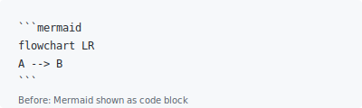
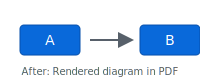

# md-mermaid-pdf

[](https://github.com/Ali-Karaki/md-mermaid-pdf/actions/workflows/ci.yml)

**Markdown to PDF with Mermaid diagrams that actually render** — not shown as plain code blocks. Fixes the common issue of [Mermaid not rendering in PDFs](https://github.com/simonhaenisch/md-to-pdf/issues) when using markdown-to-pdf tools.

### Why not md-to-pdf?

| Feature | md-to-pdf | md-mermaid-pdf |
|---------|-----------|----------------|
| Mermaid diagrams rendered | No (shows as code) | Yes |
| Same config surface | — | Yes (drop-in) |
| Zero extra setup for Mermaid | — | Yes |

Built on **[md-to-pdf](https://github.com/simonhaenisch/md-to-pdf)** (Marked + Puppeteer). Same configuration surface as `md-to-pdf`, with:

- Fenced ` ```mermaid ` blocks turned into `<div class="mermaid">` for the browser
- Mermaid loaded from a CDN (configurable), then `await mermaid.run()` before `page.pdf()`
- **Smart detection:** If the markdown has no ` ```mermaid ` block, the Mermaid script is skipped (faster, no network)

Requires network access at PDF generation time unless you inject a local script via `config.script`.

For `pdf_options`, `launch_options`, stylesheets, and other options, see the [md-to-pdf documentation](https://github.com/simonhaenisch/md-to-pdf#options).

### Visual result

| Before (md-to-pdf) | After (md-mermaid-pdf) |
|--------------------|------------------------|
| Mermaid shown as code block | Diagram rendered in PDF |
|  |  |

Run `npx md-mermaid-pdf examples/sample.md` to see the output.

## Install

Requires **Node ≥ 20.16** and **npm ≥ 10.8** (see `engines` in `package.json`).

```bash
npm install md-mermaid-pdf
```

## Programmatic use

```javascript
const { mdToPdf } = require('md-mermaid-pdf');

(async () => {
  await mdToPdf(
    { path: 'slides.md' },
    { dest: 'slides.pdf', basedir: __dirname },
  );
})();
```

(`convertMdToPdfMermaid` also writes when `dest` is a non-empty path, matching `md-to-pdf`.)

Optional: override the Mermaid bundle URL, use bundled (offline), or pass Mermaid config:

```javascript
await mdToPdf({ path: 'doc.md' }, {
  dest: 'doc.pdf',
  basedir: __dirname,
  mermaidCdnUrl: 'https://cdn.jsdelivr.net/npm/mermaid@10/dist/mermaid.min.js',
});

// Offline / CI: use bundled Mermaid (no network)
await mdToPdf({ path: 'doc.md' }, {
  dest: 'doc.pdf',
  basedir: __dirname,
  mermaidSource: 'bundled',  // or 'auto' — uses local mermaid package
});

// Customize Mermaid (theme, flowchart, etc.)
await mdToPdf({ path: 'doc.md' }, {
  dest: 'doc.pdf',
  basedir: __dirname,
  mermaidConfig: {
    theme: 'dark',
    flowchart: { curve: 'basis' },
  },
});

// Page hooks: inject CSS, tweak DOM before/after PDF
await mdToPdf({ path: 'doc.md' }, {
  dest: 'doc.pdf',
  basedir: __dirname,
  async beforeRender(page) {
    await page.addStyleTag({ content: 'body { font-size: 14px; }' });
  },
});
```

## CLI

```bash
npx md-mermaid-pdf input.md
npx md-mermaid-pdf input.md output.pdf
npx md-mermaid-pdf examples/sample.md
```

## Module system

This library is **CommonJS** (`require`). Use `require('md-mermaid-pdf')` in Node. ESM `import` works only via interop (e.g. `createRequire` or bundler resolution).

## Troubleshooting

- **Offline / air-gapped:** Mermaid loads from a CDN by default. Use `config.script` to inject a local Mermaid bundle instead.
- **Puppeteer / Chromium on CI or Linux:** Puppeteer downloads Chromium on first run. On minimal Linux images, you may need `libgbm1`, `libnss3`, or similar. See [Puppeteer troubleshooting](https://pptr.dev/guides/configuration#chrome-does-not-launch-on-linux).
- **Debug:** `debug: true` writes intermediate HTML to `.md-mermaid-pdf-debug.html` and logs Mermaid errors to stderr.
- **CI / flaky renders:** Use `mermaidWaitUntil: 'domcontentloaded'` or `mermaidRenderTimeoutMs: 10000` to tune wait behavior.

## API exports

| Export | Purpose |
|--------|---------|
| `mdToPdf` | Main entry (default export), mirrors `md-to-pdf` + Mermaid |
| `DEFAULT_MERMAID_CDN_URL` | Default jsDelivr URL pinned in this package |
| `createMermaidMarkedRenderer` | Marked renderer for ` ```mermaid ` only |
| `convertMdToPdfMermaid` | Lower level: HTML → PDF with Mermaid wait (expects merged md-to-pdf config + `browser`) |
| `generateOutputMermaid` | Lowest level: `generateOutput` fork |

## License

MIT
