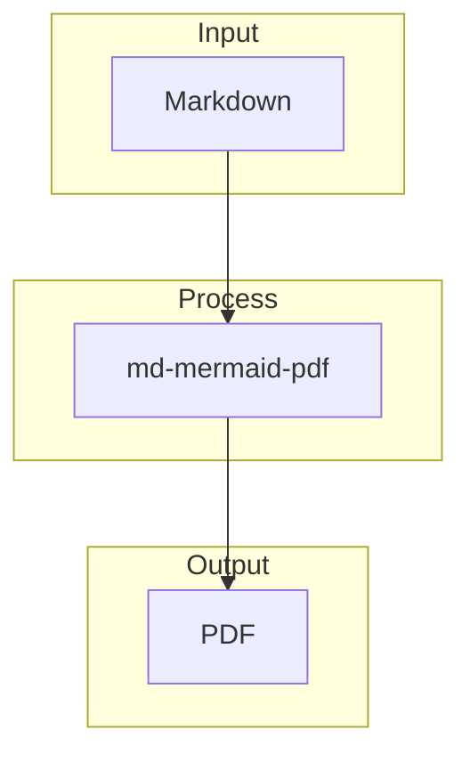

# Getting Started

A minimal docs-style example with a diagram.

## Architecture overview


```mermaid
flowchart TB
  subgraph Input
    MD[Markdown]
  end
  subgraph Process
    R[md-mermaid-pdf]
  end
  subgraph Output
    PDF[PDF]
  end
  MD --> R --> PDF
```

## Usage

```bash
npx md-mermaid-pdf examples/docs/getting-started.md
```
