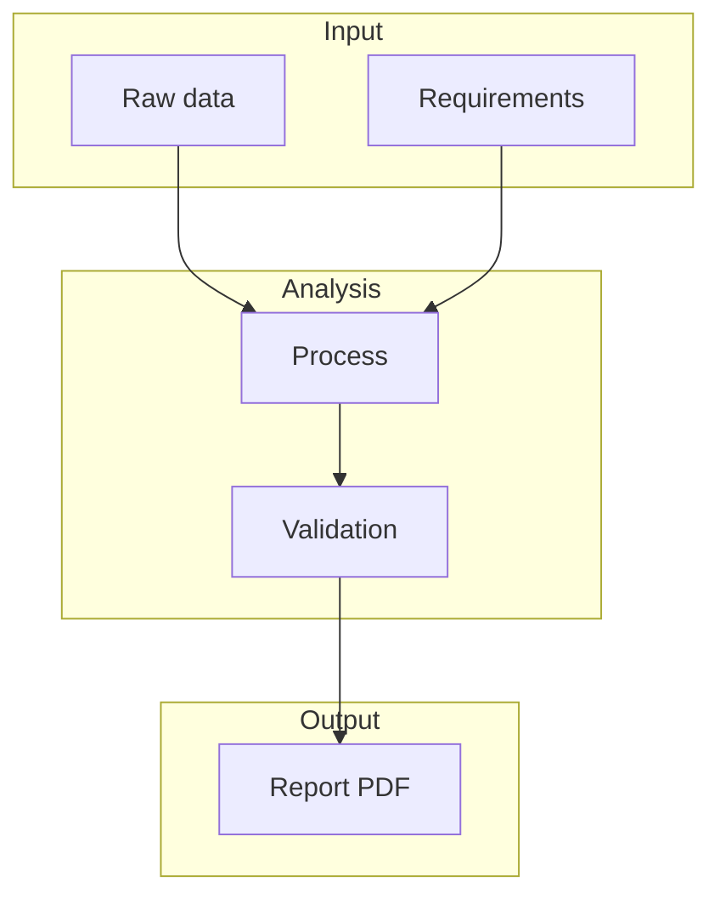
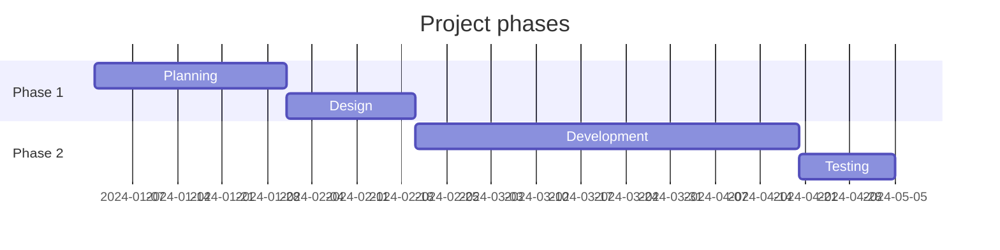

# Quarterly Report

A multi-section report example with table of contents and Mermaid diagrams.

## Executive summary

This document demonstrates `md-mermaid-pdf` with a report-style layout: headings, TOC, and embedded Mermaid diagrams.

## Process flow

## Metrics

| Metric | Q1 | Q2 | Q3 | Q4 |
|--------|----|----|----|-----|
| Revenue | 100 | 120 | 135 | 150 |
| Growth  | —   | 20% | 12% | 11% |

## Timeline

## Conclusion

Run: `npx md-mermaid-pdf examples/report/report.md` to generate the PDF.
