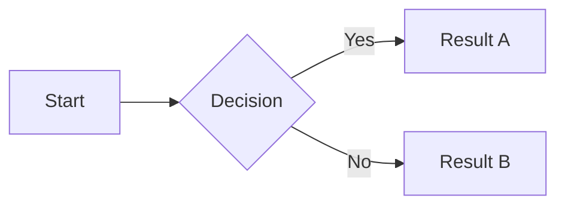
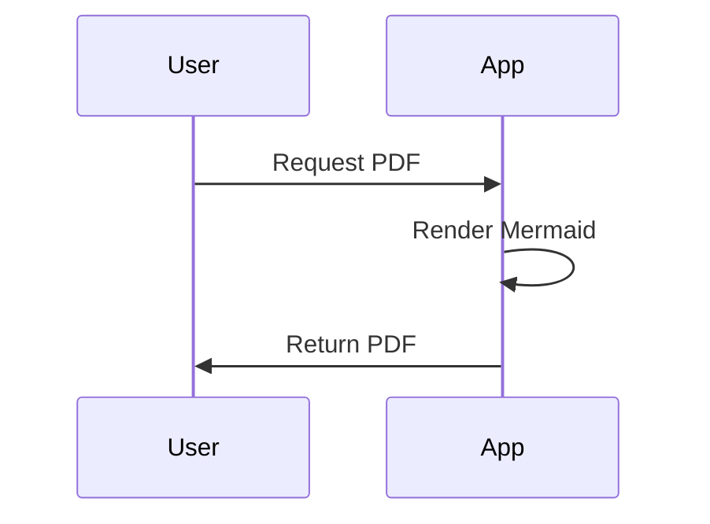

# Sample Document

A short example for `md-mermaid-pdf`. Try:

```bash
npx md-mermaid-pdf examples/sample.md
```

## Flowchart


```mermaid
flowchart LR
  A[Start] --> B{Decision}
  B -->|Yes| C[Result A]
  B -->|No| D[Result B]
```

## Sequence


```mermaid
sequenceDiagram
  participant User
  participant App
  User->>App: Request PDF
  App->>App: Render Mermaid
  App->>User: Return PDF
```
